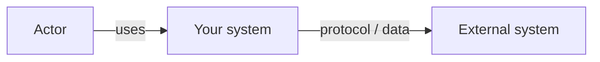
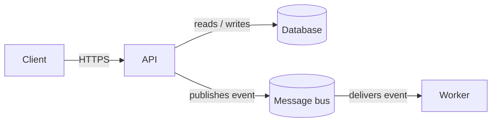
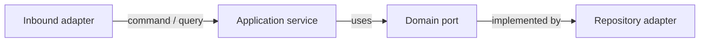
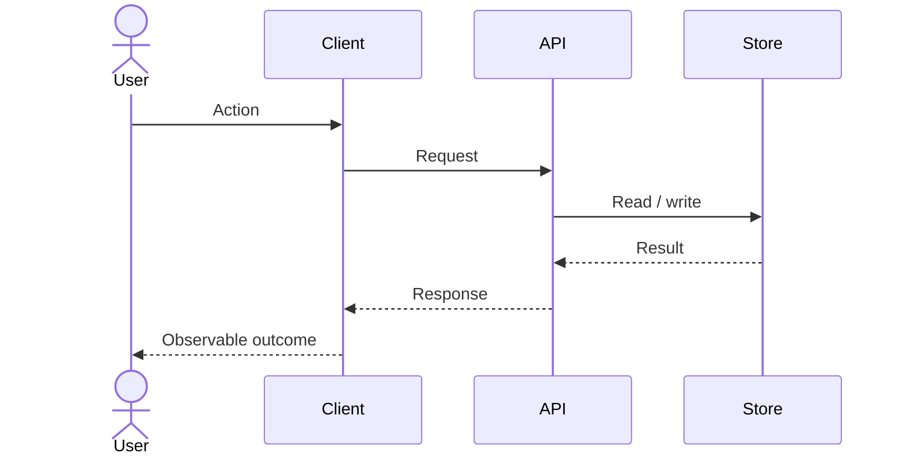
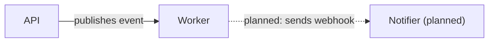

# C4 Mermaid starting points

## Context

```mermaid
flowchart LR
  actor[Actor]
  system[Your system]
  external[External system]
  actor -->|uses| system
  system -->|protocol / data| external
```

## Container

```mermaid
flowchart LR
  client[Client]
  api[API]
  worker[Worker]
  db[(Database)]
  bus[(Message bus)]
  client -->|HTTPS| api
  api -->|reads / writes| db
  api -->|publishes event| bus
  bus -->|delivers event| worker
```

## Component

```mermaid
flowchart LR
  adapter[Inbound adapter]
  service[Application service]
  port[Domain port]
  repository[Repository adapter]
  adapter -->|command / query| service
  service -->|uses| port
  port -->|implemented by| repository
```

## Dynamic

```mermaid
sequenceDiagram
  actor User
  participant Client
  participant API
  participant Store
  User->>Client: Action
  Client->>API: Request
  API->>Store: Read / write
  Store-->>API: Result
  API-->>Client: Response
  Client-->>User: Observable outcome
```

## Planned versus existing

```mermaid
flowchart LR
  api[API]
  worker[Worker]
  newsvc["Notifier (planned)"]
  api -->|publishes event| worker
  worker -.->|planned: sends webhook| newsvc
```
